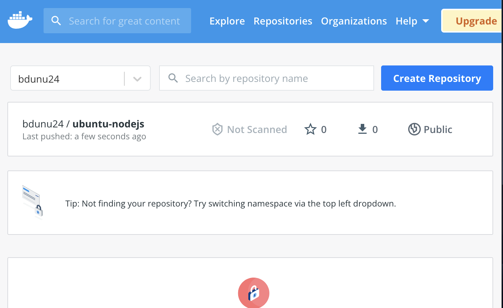

# Matomo-Web-Analytics

## *Introduction*

Welcome!

 For this third project, we're going to install **Matomo** and a **MariaDB database** on a Linux server, using **Docker Compose.** Matomo is a web analytics application, that runs on a PHP/MySQL webserver. It tracks online visits to one or more websites and displays reports on these visits for analysis. MariaDB is an open-source relational database, and is a compatible drop-in replacement for the widely used MySQL database. MariaDB is designed to be fast, scalable and robust. Docker Compose is a tool for defining and running multi-container Docker applications.

Once Nginx is installed, it will serve as our reverse proxy by intercepting requests from clients for the Matomo app. To conclude the project, we'll enable secure HTTPS connections. This will be achieved by using a **Certbot ACME (Automated Certificate Management Environment)** client, which will download and configure SSL certificates from the Let's Encrypt Certificate Authority.

# **PART 1: An Ubuntu Server & UFW Firewall Foundation

To get started, you'll need a free AWS account, and then create a virtual server using the Ubuntu 20.04 server. Once this has been created, we will enable and configure a **UFW firewall (Uncomplicated Firewall).** 

A UFW firewall is developed to ease iptables firewall configuration; UFW provides a user friendly way to create an IPv4 or IPv6 host-based firewall. It is best practice to increase the security and usability of our server, so it's able to reach optimal performance.

To create an Ubuntu server on AWS, begin by signing in to the AWS Management Console. After you have signed in, select your preferred region (this should be the closest region to your physical location).

Next, navigate to EC2 service and select Launch Instances. Select Ubuntu Server 20.04 LTS (HVM) as the Amazon Machine Image (AMI).

 After that, configure the instance by selecting t2.micro as the instance type. Next, configure the security groups by allowing all traffic from anywhere (0.0.0.0/0, ::/0). These rules will open your server to the world, and allow all IP addresses to access it. Once you have made these selections, select Review and Launch. Be sure to create or use an existing RSA key pair, then click Download. Finally, launch the instance.

## *Step 1: Logging in as Root User*

Now you'll connect to your Ubuntu instance from your local server.

As with our previous projects, we'll need to open the Terminal on your local PC. Use the 'cd' command to change into the directory that your key pair is located. This is usually the ~/Downloads directory.

Once you have your the key file (.pem) located and on hand, use the command below to activate it. This command will change the permissions (otherwise you may get the error Bad Permissions):

    $ sudo chmod 400 <private-key-name>.pem

**Reminder: Anchor Tags < > will be used to indicate contents what must be replaced with your unique values. For example, if you have a file named "keypair123.pem" you must enter this information within the corresponding anchor tag: <private-key-name>**

Next, SSH into your Ubuntu server using the following command:

    $ ssh -i <private-key-name>.pem ubuntu@<Public-IP-address>

Your server's public IP address of your Ubuntu server can be located within the Instance summary section of the EC2 Dashboard on the AWS Console.

Once we're connected to the Ubuntu server, run the following command to switch to the root user:

    $ sudo su

As the root user, you'll have access to certain privileges, such as being able to add a new user account––which will be designated for regular usage. Once we have created this new user, we will log in with this new account instead of the root user.

## *Step 2: Creating a New User*

We'll now set up a new user account with reduced privileges for day-to-day use. In this example, I'll be using my name, but feel free to change the name within anchor tags as needed.

    # adduser <belinda>

You will be asked a few questions, starting with the account password. Be sure to enter a strong password and keep it someplace safe.

For the remaining values, you have the option to fill in the information. If you do not want to fill in your information, you may skip each value by hitting 'Enter.'

## *Step 3: Granting Administrative Privileges*

Now we have a brand new user account with regular account privileges. However, sometimes we may need to perform administrative tasks, which require higher privileges. We can assign superuser or root privileges by placing sudo before our commands.

In order to add these privileges to our new user, we need to add the user to the sudo group. The Ubuntu 20.04 server enables users to use the sudo command by default, if they are members of the sudo group.

Let's continue by adding the newly created user to the sudo group:

    # usermod -aG sudo <cecilia>

Now, when you are logged in as your regular user, you can type sudo before commands to run them with superuser privileges.

## *Step 4: Setting Up a Basic Firewall*

The UFW firewall ensures that only connections to certain services are accepted.

OpenSSH is the service that will allow us to connect to our server, and it has a profile registered with UFW!

Ypu can see this by typing the following command:

    # ufw app list

In order to ensure that the firewall allows SSH connections so that we can log back in later, use the following command:

    # ufw allow OpenSSH

Next, enable the firewall using the following command:

    # ufw enable

After using this command, you will be asked whether or not you wish to proceed. Type 'Y' and then type 'Enter' to proceed.

In order to examine the status of SSH connections, use the following command:

    # ufw status

## *Step 5: Enabling External Access for Your Regular User*

So we have now established a regular user, which may be used to daily tasks. Next, we must ensure that we can directly SSH into the regular user account.

In order to achieve this configuration, we must determine whether our Ubuntu server’s root account uses a password or SSH keys for authentication.

## If the root Account Uses Password Authentication

If you logged in to your root account using a password, then that means that password authentication is enabled for SSH. Therefore, we can SSH into the new user account using the following command:

    $ ssh <belinda>@your_server_public_ip

When prompted, enter your regular user’s password and then press Enter. Remember, whenever necessary, use administrative privileges by typing 'sudo' before commands. You will be prompted for your regular user password when using sudo for the first time or periodically throughout each session.

Example:

    $ sudo <command_to_run>

## TROUBLESHOOTING:

It is possible to receive an error message that says: **Permission Denied (publickey).** If you do not have this error, please skip ahead to the next section below. Otherwise, if you do have this error, then we can resolve it by modifying the configuration file. Use the following command in your Ubuntu server:

    $ sudo nano /etc/ssh/sshd_config

Next, scroll through the file and make the following changes:

Change **# PermitRootLogin prohibit-password** to the following:

    # PermitRootLogin yes

Next, change **# PasswordAuthentication no** to the following:

    # PasswordAuthentication yes

Once you have made these changes, save the file using 'ctrl + O,' and then exit Nano using 'ctrl + X.'

Next, restart the server by running the following command:

    $ sudo service ssh restart

You should now be able to SSH with your new username. Try this command again:

    $ ssh cecilia@<your_server_ip>

# Part 2: How to Set Up SSH Keys on your PC

SSH, or secure shell, is an encrypted protocol which is used to administer and communicate with other servers. SSH keys provide a secure way to log into your Ubuntu server, which is aligns with best security practices.

In order to enhance your Ubuntu server’s security, it is strongly recommended to set up SSH keys instead of using password authentication.

## *Step 1: Creating the Key Pair*

You'll want to begin by creating a key pair on the client machine (usually your computer):

    $ ssh-keygen

Next, press enter to save the key pair into the .ssh subdirectory in your home directory. You may specify an alternate path if you prefer to do so.

You will then be prompted to enter a passphrase. It is best practice to enter a secure passphrase, in order to prevent unauthorized users from logging in.

Once you have entered your passphrase, you should then see the output similar to the screenshot below:

You now have a public and private key that you can use to authenticate. The next step is to place the public key on your server.

## *Step 2: Copying the Public Key to Your Ubuntu Server*

The quickest and easiest way to copy your public key to the Ubuntu host is to use a utility called 'ssh-copy-id.' This useful tool is included by default in many operating systems. However, in order for this method to work, you must already have password-based SSH access to your server.

To use the utility, specify the username and remote host that you would like to connect to, as outlined in the following command:

The command is:

    $ ssh-copy-id <username>@<remote_host>

You will see an "authenticity of host" message, which means that your local computer does not recognize the remote host. This will happen the first time you connect to a new host. Type 'yes' and press 'Enter' to continue.

Next, the utility will scan your local account for the id_rsa.pub key that we created earlier. Once it locates the key, it will prompt you for the password of the remote user’s account.

Type in the password and press ENTER. You should see something like this:

Now, your id_rsa.pub key has been successfully uploaded to the remote account!

# Part 3: Installing Docker

Docker is an application that simplifies the process of managing application processes in containers. Containers allow users to run applications in resource-isolated processes. In this section, we will install Docker then use it to work with containers and images, and then push an image to a Docker Repository.

## *Prerequisites*

Prior to proceeding, you will need the following:

- One Ubuntu 20.04 server set up including a sudo non-root user and a firewall.

- An account on Docker Hub if you wish to create your own images and push them to Docker Hub

## *Step 1: Docker Installation Procedure*

To ensure we get the latest version, we’ll need to install Docker from the official Docker repository. To do that, we’ll add a new package source, add the GPG key from Docker to ensure the downloads are valid, and then install the package.

First, while logged into your regular user account, update your existing list of packages using the following command:

    $ sudo apt update

When prompted, type in your regular user's password, then press Enter. Next, install a few prerequisite packages which let apt use packages over HTTPS using the following command:

    $ sudo apt install apt-transport-https ca-certificates curl software-properties-common

After using this command, you will be prompted whether or not you wish to proceed. Type 'Y' and then type 'Enter' to proceed with the instillation.

Next, add the GPG key for the official Docker repository to your system using the following command:

    $ curl -fsSL https://download.docker.com/linux/ubuntu/gpg | sudo apt-key add -

You should see an output that says: 'OK'

Next, add the Docker repository to APT sources using the following command:

    $ sudo add-apt-repository "deb [arch=amd64] https://download.docker.com/linux/ubuntu $(lsb_release -cs) stable"

This will also update our package database with the Docker packages from the newly added repository.

Next, ensure that you are installing from the Docker repo, rather than the default Ubuntu repo, by running the following command:

    $ apt-cache policy docker-ce

Lastly, install Docker:

    $ sudo apt install docker-ce

When prompted, press 'Y' to continue instillation.

The instillation may take a few minutes––please be patient! Once the instillation is complete, check to see that it’s running using the following command:

    $ sudo systemctl status docker

The output should be similar to the following, which shows that the service is active and running:

Installing Docker adds the capability of using the Docker service (daemon) and the docker command line utility (Docker client). We will delve deeper into this shortly.

## *Step 2: Executing the Docker Command without Sudo (Optional)*

By default, the docker command can only be run the root user or by a user in the docker group, which is automatically created during Docker’s installation process.

Add your username to the docker group using the following command:

    $ sudo usermod -aG docker ${USER}

To apply the new group membership, log out of the server and back in, or type the following:

    $ su - ${USER}

You will be prompted to enter your user’s password to continue. Confirm that your user is now added to the Docker group by typing the following:

    $ groups

If you need to add a user to the docker group that you’re not logged in as,use the following command:

    $ sudo usermod -aG docker <username>

## *Step 3: Using the Docker Command*

The docker command syntax takes this form:

Example:

    $ docker <option> <command> <arguments>

To view all available subcommands, type:

    $ docker

As of **Docker 19**, the complete list of available subcommands include the following:

    Output:

    attach      Attach local standard input, output, and error streams to a running container
    build       Build an image from a Dockerfile
    commit      Create a new image from a container's changes
     cp          Copy files/folders between a container and the local filesystem
    create      Create a new container
    diff        Inspect changes to files or directories on a container's filesystem
    events      Get real time events from the server
    exec        Run a command in a running container
    export      Export a container's filesystem as a tar archive
    history     Show the history of an image
    images      List images
    import      Import the contents from a tarball to create a filesystem image
    info        Display system-wide information
    inspect     Return low-level information on Docker objects
    kill        Kill one or more running containers
    load        Load an image from a tar archive or STDIN
    login       Log in to a Docker registry
    logout      Log out from a Docker registry
    logs        Fetch the logs of a container
    pause       Pause all processes within one or more containers
    port        List port mappings or a specific mapping for the      container
    ps          List containers
    pull        Pull an image or a repository from a registry
    push        Push an image or a repository to a registry
    rename      Rename a container
    restart     Restart one or more containers
    rm          Remove one or more containers
    rmi         Remove one or more images
    run         Run a command in a new container
    save        Save one or more images to a tar archive (streamed to STDOUT by default)
    search      Search the Docker Hub for images
    start       Start one or more stopped containers
    stats       Display a live stream of container(s) resource usage  statistics
    stop        Stop one or more running containers
    tag         Create a tag TARGET_IMAGE that refers to SOURCE_IMAGE
    top         Display the running processes of a container
    unpause     Unpause all processes within one or more containers
    update      Update configuration of one or more containers
    version     Show the Docker version information
    wait        Block until one or more containers stop, then print their exit codes

To view the options available to a specific command, type:

    $ dockerdocker-subcommand --help

To view system-wide information about Docker, use:

    $ docker info

Let’s explore some of these commands. We’ll start by working with images.

## *Step 4: Working with Docker Images*

Docker containers are built from Docker images. Docker image is a template that contains instructions for deploying containers. By default, Docker pulls these images from Docker Hub, which is a Docker registry managed by Docker.

To check whether we can access and download images from Docker Hub, run the following command:

    $ docker run hello-world

The output below ndicates that Docker is working correctly:

Initially, Docker was unable to find the hello-world image locally, therefore it downloaded the image from Docker Hub.

Then, Docker created a container from the image and the application within the container executed, displaying the message shown in the output above!

We can also search for images available on Docker Hub. Let's use the following command to search for the Ubuntu image:

    $ docker search ubuntu

This script will crawl Docker Hub and return a listing of all images whose name match the search string:

Execute the following command to download the official ubuntu image to your computer:

    $ docker pull ubuntu

You’ll see the following output:

Now that the image has been downloaded, you can then run a container using the downloaded image with the run subcommand.

To see the images that have been downloaded to your computer, type:

    $ docker images

The output will look similar to the one below:

As you’ll see later in this tutorial, images that you use to run containers can be modified and used to generate new images! These can then be uploaded (or pushed) to Docker Hub.

In the next step, we will examine how to run containers.

## *Step 5: Running a Docker Container*

The hello-world container that was run in the previous step is an example of a container that runs and exits after emitting a test message.

We'll run a container using the latest image of Ubuntu. The combination of the -i and -t switches grants interactive shell access into the container:

    $ docker run -it ubuntu

You should notice that the prompt will reflect the fact that you’re now working inside of the container!

In this case, it will look like this:

    Output:

    root@f8ebacced4ee:/#

Now you can run any command inside the container! For example, let’s update the package database inside the container as the root user:

    # apt update

Then install any application in it. Let’s install Node.js:

    # apt install nodejs

This command installs Node.js in the container from the official Ubuntu repository.

Select the geographic area that you live in. Select the city and region that best corresponds to your time zone:

When the installation is complete, verify that Node.js is installed using the following command:

    # node -v

You’ll see the version number displayed in your terminal:

    Output:

    v10.19.0

To exit the container, type 'exit.'

Awesome work! In the next section, we will look at managing the containers on our system.

## *Step 6: Managing Docker Containers*

In order to view the active (running) containers on your computer, use the following:

    $ docker ps

Recall that earlier in this tutorial, we started two containers. One was from the hello-world image, and the other was from the ubuntu image. Both of the containers are no longer running, however they still exist on your system!

To view all containers — both active and inactive, use the following:

    $ docker ps -a

Next, to view the latest container you created, use the following:

    $ docker ps -l

Here is a summary of what you can expect to see as the output:

To start a container, use 'docker start,' followed by the container ID or the container’s name.

Let’s start the Ubuntu-based container with the ID of f8ebacced4ee:

    $ docker start f8ebacced4ee

You may use 'docker ps' again to see the container's status. You’ll see output similar to this:

To stop a running container, use 'docker stop,' followed by the container ID or name. This time, we’ll use the name that Docker assigned the container, which is agitated_jackson:

    $ docker stop agitated_jackson

Once you’ve decided you no longer need a container anymore, remove it with the 'docker rm' command, again using either the container ID or the name. Use the 'docker ps -a' command to find the container ID or name for the container associated with the hello-world image and remove it.

    $ docker rm condescending_heisenberg

You can start a new container and give it a name using the '--name' switch. You can also use the '--rm' switch to create a container that removes itself when it’s stopped.

For more information on these options and others, run the 'docker run help' command.

Containers can be turned into images which you can use to build new containers. Let’s discover how this works together in the upcoming steps.

## *Step 7: Committing Changes in a Container to a Docker Image*

When starting a Docker image, you can create, modify, and delete files just like you can with a virtual machine! Keep in mind that the changes that you make will only apply to that container. Furthermore, you can start and stop it, however, once you destroy it with the 'docker rm' command, there is **no going back!**

In this next step, we will learn how to save the state of a container as a new Docker image.

In order to commit the changes to a new Docker image instance, use the following command format:

    $ docker commit -m "What you did to the image" -a "Author Name" container_idrepository/new_image_name

- The -m switch is for the commit message that helps you and others know what changes you made.

- The  -a switch is used to specify the author.

- The container_id is the one you noted earlier in the tutorial.

- The repository is usually your Docker Hub username.

For example, for the user belinda, with the container ID of f8ebacced4ee, the command would be:

    $ docker commit -m "added Node.js" -a "belinda" f8ebacced4ee belinda/ubuntu-nodejs

When you commit an image, the new image is saved locally on your computer. Later in this tutorial, we will learn how to push an image to a Docker registry like Docker Hub so others can access it.

We can list all of the Docker images, including the the new image and the old ones that it was derived from, using the following:

    $ docker images

You’ll should see an output like this:

In this example, 'ubuntu-nodejs' is the new image, which was derived from the existing 'ubuntu' image from Docker Hub.

You can also build Images from a Dockerfile, which allows you to automate the installation of software in a new image.

Now let’s share the new image with others, so they may also create containers from it.

## *Step 8: Pushing Docker Images to a Docker Repository*

This step shows you how to push a Docker image to Docker Hub. To push an image to Docker Hub or any other Docker registry, you must have an account.

To push your image, first log into Docker Hub, use the following command:

    docker login

You will be prompted to authenticate using your Docker Hub password. Once you type in your password, the message will display "login succeeded".

**Note:** If your Docker registry username is different from the local username you used to create the image, you will have to tag your image with your registry username. For the example given in the last step, use the following command:

    $ docker tag 429922e50553 bdunu24/ubuntu-nodejs

To push the ubuntu-nodejs image to your Docker repository, the command would be:

    $ docker push ceciliacloud/ubuntu-nodejs

The process may take some time to complete as it uploads the images, but when completed, the output will look like this:

After pushing an image to a registry, it should be listed on your account’s dashboard, as shown in the image below:

# Part 4: Docker Compose

Docker Compose is a tool that allows users to run multi-container application environments based on the definitions set in a YAML file. It then utilizes service definitions to build fully customizable environments with multiple containers that can share networks and data volumes.

In this guide, we will demonstrate how to install Docker Compose on an Ubuntu 20.04 server and then how to use this tool!

Prior to beginning, please ensure that you have installed the most updated, stable version of Docker Compose––this can be downloaded from the official Github repository. At the time of this writing, the most current stable version is 1.27.4.

The following command will download the 1.27.4 release and save the executable file at /usr/local/bin/docker-compose, which will make this software globally accessible as docker-compose:

    $ sudo curl -L "https://github.com/docker/compose/releases/download/1.27.4/docker-compose-$(uname -s)-$(uname -m)" -o /usr/local/bin/docker-compose

When prompted, type your regular user's password and press 'Enter.'

Next, set the correct permissions so that the docker-compose command is executable:

    $ sudo chmod +x /usr/local/bin/docker-compose

To verify that the installation was successful, you can run:

    $ docker-compose --version

You’ll see output similar to this:

Docker Compose is now successfully installed on your system! In the next section, we’ll see how to set up a docker-compose.yml file and get a containerized environment up and running with this tool.

## *Step 1: Setting up a docker-compose.yml File*

To demonstrate how to set up a *docker-compose.yml* file and work with Docker Compose, we'll create a web server environment using the official Nginx image from Docker Hub, which is the public Docker registry. This containerized environment will serve a single static HTML file.

Now that we're all set up, let's begin by creating a new directory in your home folder, and then changing into it's directory:

    $ mkdir ~/compose-demo

    $ cd ~/compose-demo

In this directory, set up an application folder to serve as the document root for your Nginx environment:

    $ mkdir app

Using your preferred text editor, create a new index.html file within the app folder:

    $ nano app/index.html

Place the following content into the '~/compose-demo/app/index.html' file:

    <!doctype html>
    <html lang="en">
    <head>
    <meta charset="utf-8">
    <title>Docker Compose Demo</title>
    <link rel="stylesheet" href="https://cdn.jsdelivr.net/gh/kognise/water.css@latest/dist/dark.min.css">
    </head>
    <body>
    <h1>This is a Docker Compose Demo Page.</h1>
     
This content is being served by an Nginx container.

    </body>
    </html>

Save and close the file when you’re done. If you are using nano, you can do that by typing 'CTRL+X,' then 'Y' and 'Enter' to confirm.

Next, create the docker-compose.yml file:

    $ nano docker-compose.yml

Insert the following content on your docker-compose.yml file, then save and close the file:

    version: '3.7'
    services:
        web:
          image: nginx:alpine
          ports:
            - "8000:80"
          volumes:
            - ./app:/usr/share/nginx/html

As demonstrated above, the 'docker-compose.yml' file begins with the 'version' definition. This tells Docker Compose which configuration version we are using.

We then have the 'services' block, which is the location of the services that are part of this environment. In our case, we have a single service called 'web.' This service uses the 'nginx:alpine' image and then sets up a port redirection with the 'ports' directive. All of the requests on port 8000 of the host machine (the system from where you’re running Docker Compose) will be redirected to the 'web' container on port 80, where Nginx will be running.

Finally, the volumes directive will create a shared volume between the host machine and the container. This will share the local *app* folder with the container, and the volume will be located at */usr/share/nginx/html* inside the container, which will then overwrite the default document root for Nginx.

Save and close the file.

Now we have set up a demo page and a *docker-compose.yml* file which will be used to create a containerized web server environment that will serve it.

In the next step, we’ll bring this environment up with Docker Compose.

## *Step 2:Running Docker Compose*

The following command will download the necessary Docker images, create a container for the web service, and run the containerized environment in background mode:

    $ docker-compose up -d

You should see something like this:

To verify that the container is active, run the following:

    $ docker-compose ps

This command will show you information about the running containers and their state, in addition to any port redirections that are currently in place.

You can now access the demo application by pointing your browser to either *'localhost:8000'* if you are running this demo on your local machine, or *'your_server_domain_or_IP:8000'* if you are running this demo on a remote server.

You should see a page similar to this:

In the next step, we'll discover how to manage our containerized environment with Docker Compose commands.

## *Step 3: Getting Familiar with Docker Compose Commands*

Now that we have seen how to set up a docker-compose.yml file and bring your environment up with docker-compose up. We will next discover how to use Docker Compose commands to manage and interact with your containerized environment.

To check the logs produced by your Nginx container, you can use the logs command:

    $ docker-compose logs

You’ll see output similar to this:

If you want to pause the environment execution without changing the current state of your containers, you can use:

    $ docker-compose pause

To resume execution after issuing a pause:

    $ docker-compose unpause

The *'stop'* command will terminate the container execution, but it won’t destroy any data associated with your containers:

    $ docker-compose stop

If you want to remove the containers, networks, and volumes associated with this containerized environment, use the down command:

    $ docker-compose down

The output will appear similar to this:

In case you want to also remove the base image from your system, you can use:

$ docker image rm nginx:alpine

Lastly, to enable SSL you’ll need a domain name pointed at your server’s public IP address. This should be something like example.com.

If you do not already a domain, you can create a new domain using Google Domains:

To set up a domain with your cloud account, you need to add it (and any of its existing DNS records) to the control panel, then delegate the domain by updating your registrar to use your domain name servers.

Above is an example of my Ubuntu server's public IP address added to my personal domain's DNS records using Google Domains.

Once you’ve satisfied all the prerequisites, proceed to Part 5, where you’ll download and launch the Matomo software.

# Part 5: Running Matomo and MariaDB with Docker Compose

This section will put our configuration inside a matomo directory in our home directory.

Let's begin by creating the Docker Compose configuration that will launch containers for both the Matomo app and a MariaDB database.

First, ensure you’re in your home directory:

    $ cd ~
Then create the matomo directory and cd into it:

$ mkdir matomo

$ cd matomo
Now open a new blank YAML file called docker-compose.yml:

$ nano docker-compose.yml
This is the configuration file that the docker-compose software will read when bringing up your containers. Paste the following into the file:

docker-compose.yml

version: "3"

services:
  db:
    image: mariadb
    command: --max-allowed-packet=64MB
    restart: always
    environment:
      - MARIADB_DATABASE=matomo
      - MARIADB_USER
      - MARIADB_PASSWORD
      - MARIADB_ROOT_PASSWORD
    volumes:
      - ./db:/var/lib/mysql

  app:
    image: matomo
    restart: always
    volumes:
      - ./matomo:/var/www/html
    ports:
      - 127.0.0.1:8080:80

This file defines two services, one db service which is the MariaDB container, and an app service which runs the Matomo software. Both services also reference a named volume where they store some data, and the app service also opens up port 8080 on the loopback (127.0.0.1) interface, which we will connect to via localhost.

Save the file and exit your text editor to continue. In nano, press CTRL+O then ENTER to save, then CTRL+X to exit.

The MariaDB container needs some configuration to be passed to it through environment variables in order to function properly.

It is best practice to keep passwords out of your docker-compose.yml file, especially if you’ll be committing it to a Git repository or other source control system.

Instead, we’ll put the necessary information in a .env file in the same directory, which the docker-compose command will automatically load when we start our containers.

Open a new .env file with nano:

$ nano .env
You’ll need to fill in a user name and password, as well as a strong password for the MariaDB root superuser account:

.env

MARIADB_USER=matomo
MARIADB_PASSWORD=a_strong_password_for_user
MARIADB_ROOT_PASSWORD=a_strong_password_for_root
If you need help creating strong passwords you can use the openssl command to print out a random 30 character hash, which you can use as a password:

$ openssl rand 30 | base64 -w 0 ; echo
When you’re done filling out the information in your .env file, save it and exit your text editor.

Next, let's bring up the two containers with docker-compose using the following command:

$ sudo docker-compose up -d
The up subcommand tells docker-compose to start the containers (and volumes and networks) defined in the docker-compose.yml file. The -d flag tells it to do so in the background (“daemonize”), as shown here:

When that’s done, Matomo should be running. You can test that a webserver is running at localhost:8080 by fetching the homepage using the curl command:

$ curl --head http://localhost:8080
This will print out only the HTTP headers from the response:

The 200 OK response means the Matomo server is up and running, but it’s only available on localhost. The highlighted X-Matomo-Request-Id header indicates that the server is Matomo and not something else that might be configured to listen on port 8080. Next we’ll set up Nginx to proxy public traffic to the Matomo container.

Installing and Configuring Nginx
The use of the Nginx in front of our Matomo server can improve performance by offloading caching, compression, and static file serving to a more efficient process.

First, refresh your package list, then install Nginx using the following commands:

$ sudo apt update

$ sudo apt install nginx
Allow public traffic to ports 80 and 443 (HTTP and HTTPS) using the “Nginx Full” UFW application profile:

$ sudo ufw allow "Nginx Full"
Output:

Rule added
Rule added (v6)
Next, open up a new Nginx configuration file in the /etc/nginx/sites-available directory:

$ sudo nano /etc/nginx/sites-available/matomo.conf
Paste the following into the new configuration file. Be sure to replace your_domain_here with the domain that you’ve configured to point to your Matomo server:

/etc/nginx/sites-available/matomo.conf

server {
    listen       80;
    listen       [::]:80;
    server_name  your_domain_here;

    access_log  /var/log/nginx/matomo.access.log;
    error_log   /var/log/nginx/matomo.error.log;

    location / {
      proxy_set_header X-Forwarded-For $proxy_add_x_forwarded_for;
      proxy_set_header X-Real-IP $remote_addr;
      proxy_set_header X-Forwarded-Host $host;
      proxy_set_header X-Forwarded-Proto https;
      proxy_pass http://localhost:8080;
  }
}

Save and close the file, then enable the configuration by linking it into /etc/nginx/sites-enabled/:

$ sudo ln -s /etc/nginx/sites-available/matomo.conf /etc/nginx/sites-enabled/
Use nginx -t to verify that the configuration file syntax is correct:

$ sudo nginx -t
And finally, reload the nginx service to pick up the new configuration:

$ sudo systemctl reload nginx

Your Matomo site should now be available on plain HTTP. Load http://your_domain_here (you may have to click through a security warning) and it will look like this:

Now that you have your site up and running over HTTP, it’s time to secure the connection with Certbot and Let’s Encrypt certificates. You should do this before going through Matomo’s web-based setup procedure.

Installing Certbot and Setting Up SSL Certificates
Thanks to Certbot and the Let’s Encrypt free certificate authority, adding SSL encryption to our Matomo app will take only two commands.

First, install Certbot and its Nginx plugin:

$ sudo apt install certbot python3-certbot-nginx

When prompted, press Y to continue instillation.

Next, run certbot in --nginx mode, and specify the same domain you used in the Nginx server_name config:

$ sudo certbot --nginx -dyour_domain_here
You will be prompted to agree to the Let’s Encrypt terms of service, and to enter an email address.

Next, you’ll be asked if you want to redirect all HTTP traffic to HTTPS. It is generally recommended and safe to do.

Next, Let’s Encrypt will confirm your request and Certbot will download your certificate:

Setting Up Matomo
Back in your web browser you should now have Matomo’s Welcome! page open via a secure https:// connection. Now you can enter usernames and passwords safely to complete the installation process.

Click the Next button. You’ll be taken to the System Check step:

This is a summary of the system Matomo is running on, and everything should be green checkmarks indicating there are no problems. Scroll all the way to the bottom and click the Next button.

Now you’ll be on the Database Setup page:

The information you fill in on this page will tell the Matomo application how to connect to the MariaDB database. You’ll need the MARIADB_USER and MARIADB_PASSWORD that you chose in Step 1. You can copy them out of your .env file if you need to.

Fill out the first four fields:

Database Server: db
Login: the username you set in the MARIADB_USER environment variable
Password: the password you set in the MARIADB_PASSWORD environment variable
Database Name: matomo
Click Next once more. You’ll get a confirmation that the database Tables were set up correctly.

Click Next again. You’ll then need to set up an admin super user.

Lastly, you will set up information about the first website you want to collect analytics for.

After these steps are complete, you should end up on step 8, a Congratulations page. You’re almost all done. Scroll down to the bottom and click the Continue to Matomo button, and you’ll be taken to the homepage:

There will be a large warning at the top of the page. There’s a small update you’ll need to do to Matomo’s configuration file to finish up this process.

Back on the command line, open up the configuration file with a text editor:

$ sudo nano matomo/config/config.ini.php
Near the top you should have a [General] section as shown below. Add these lines to the end of that section:

trusted_hosts[] = "localhost:8080"
assume_secure_protocol = 1
force_ssl = 1

These options let Matomo know that it’s safe to use port 8080, and that it should assume it’s always being accessed over a secure connection.

Save and close the configuration file, then switch back to your browser and reload the page. The error should be gone, and you’ll be presented with a login prompt:

Log in with the admin account you created during setup, and you should be taken to the dashboard:

Please note, that since you probably have not set up your tracking code yet, the dashboard will indicate that no data has been recorded.

Simply follow the instructions to finish setting up the JavaScript code on your website to start receiving analytics data!

Conclusion
Congratulations! You have successfully launched the Matamo analytics app and a MariaDB database using Docker Compose, and then set up an Nginx reverse proxy and secured it using Let’s Encrypt SSL certificates!